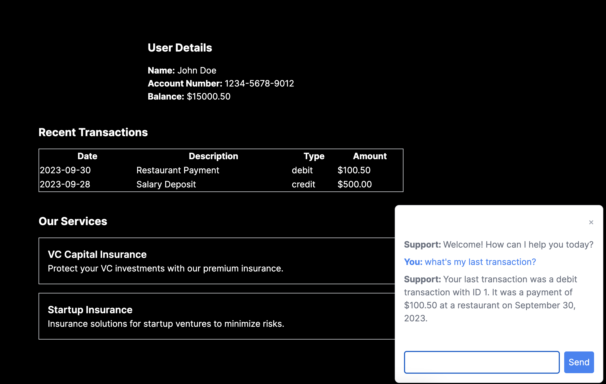

# VC-Armor

## Introduction


Check it here [VC-Armor Live Demo](https://armor-tau.vercel.app/)



VC-Armor is an innovative solution presented for the BOC-4.0 hackathon challenge. It showcases the capabilities of a live AI chat integrated into a bank's client area. This platform is designed to offer financial management support, advice, and advertise tailored banking services such as capital insurance, VC capital insurance, and startup insurance. All these features are presented on a demo page built with Next.js which mimics a customer's bank client area.


### Key Features

1. **Live AI Chat**: An intelligent chatbot that works with customers' private data seamlessly integrated into their banking page.
2. **Financial Management**: The chatbot can provide tailored financial advice based on the customer's transactions, savings, investments, and more.
3. **Service Advertisements**: Recommends specific bank services like insurance for VC capital, startups, etc., tailored to the customer's financial profile.
4. **Next.js Demo**: A demonstrative bank client area built with Next.js for showcasing the chatbot in action.

## Important Notice

This project is for **demonstration purposes only**. Real-world applications involving sensitive information like banking details should adhere to all relevant data protection and privacy regulations.

## Getting Started

### Prerequisites

- Node.js
- Yarn or npm
- A modern web browser

### Installation

1. Clone the repository
```bash
git clone https://github.com/yourusername/vc-armor.git
```

2. Navigate to the project directory
```bash
cd vc-armor
```

3. Install dependencies
```bash
yarn install
```

4. Run the development server
```bash
yarn dev
```

Now, the demo should be up and running at `http://localhost:3000`.

## Contributing

Feel free to fork the repository, make changes, and create pull requests. We welcome all contributions to make VC-Armor even better!

## License

VC-Armor is open source under the MIT License. Refer to the LICENSE file in the repository for more details.

---

Remember, it's crucial to protect sensitive data, especially in a banking environment. This demo should be used with caution and should not handle real banking or private data without rigorous security measures in place.